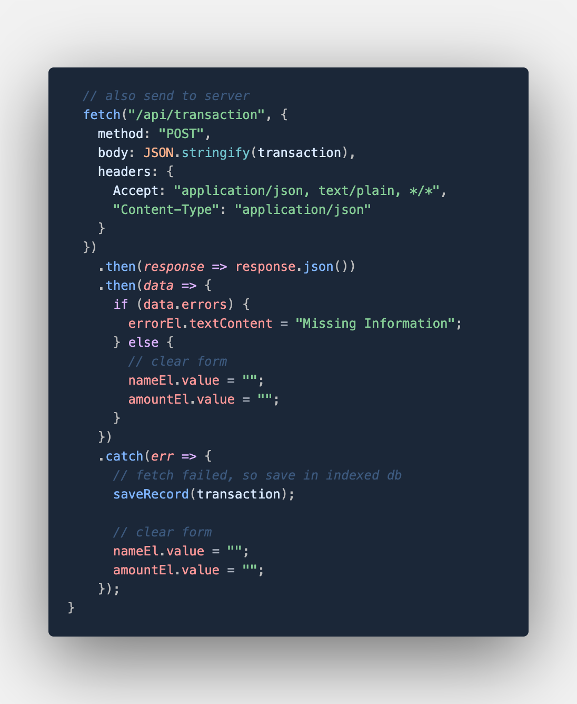
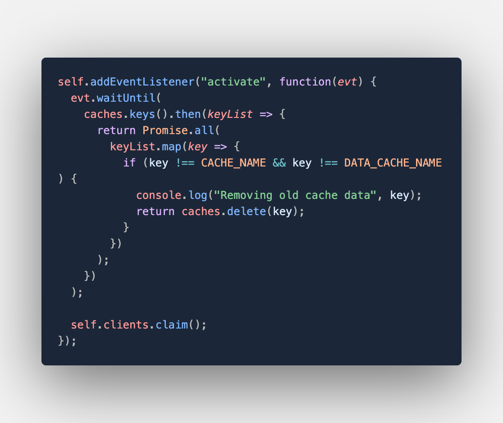

# Daily Budget Tracker

Giving users a fast and easy way to track their money is important, but allowing them to access that information anytime is even more important. Having offline functionality is paramount to my applicaiton's success. 

## User Story
If you are traveling, you may use this application to track any withdrawls or deposits with or without a data/internet connection, so that your account balance will remain accurate.

## Languages Used
* Javascript
* HTML
* Node
* PWA (Progressive Web Application)
* API

## Directions
1. Enter Transaction Name/Amount while online or offline.
2. See the chart on the applicaton change as the transaction input is updated.
3. When the page is refreshed, the Transaction data remains the same.

## Screenshots

